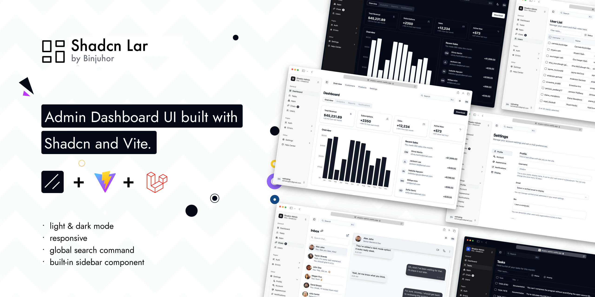

# Laravel Shadcn Admin Dashboard

A modern, responsive, and accessible admin dashboard built with Shadcn UI, Laravel, and Vite. This project combines the elegance of Shadcn's UI components with the robustness of Laravel's backend framework, providing a seamless development experience.



This project is inspired by [Shadcn-admin](https://github.com/satnaing/shadcn-admin) and adapted to work seamlessly with Laravel and Inertia.js.

## Features

- Light/dark mode
- Responsive
- Accessible
- With built-in Sidebar component
- Global Search Command
- 10+ pages
- Extra custom components

## Tech Stack

**UI:** [ShadcnUI](https://ui.shadcn.com) (TailwindCSS + RadixUI)

**Backend:** [Laravel](https://laravel.com/) 12.x

**Frontend Integration:** [InertiaJs](https://inertiajs.com/)

**Build Tool:** [Vite](https://vitejs.dev/)

**Type Checking:** [TypeScript](https://www.typescriptlang.org/)

**Linting/Formatting:** [Eslint](https://eslint.org/) & [Prettier](https://prettier.io/)

**Icons:** [Tabler Icons](https://tabler.io/icons)

## Run Locally

1. Clone the project

```bash
  git clone git@github.com:binjuhor/shadcn-lar.git
```

2. Go to the project directory

```bash
  cd shadcn-lar
```

3. Install dependencies

- Install JavaScript dependencies:

```bash
  pnpm install
```

- Install PHP dependencies:

```bash
  composer install
```

- Data migration

```bash
  php artisan migrate
```

4. Start the dev
Frotnedend and Backend server
- Start the Vite development server:

```bash
  pnpm run dev
```
- Start the Laravel development server:

```bash
  php artisan serve
```

5. Open your browser and visit http://localhost:8000 to view the dashboard.

## Roadmap

Here are some of the planned features for future updates:

- **User Permissions & Roles:** Manage user roles and permissions with a flexible and intuitive system.

- **Profile Manager:** Allow users to update their profiles, including personal information and security settings.

- **Post & Page Manager:** Create and manage dynamic posts and pages with a rich text editor.

- **Theme & Plugin Manager:** Easily install and manage themes and plugins to extend functionality.

- **File & Media Manager:** A powerful file and media manager for handling uploads and organizing assets.


## Author

This project was crafted with 🤍 by [@binjuhor](https://github.com/binjuhor)

## License

This project is open-source and licensed under the [MIT License](https://choosealicense.com/licenses/mit/). Feel free to use, modify, and distribute it as needed.
